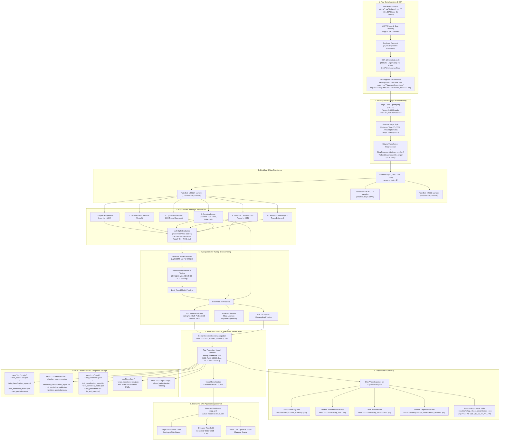

# Credit Card Fraud Detection Using Machine Learning and Explainable AI

## Project Overview

This project develops a machine learning system for detecting fraudulent credit card transactions. Since fraud detection is a highly imbalanced classification problem, the project focuses not only on overall accuracy but also on **precision, recall, F1-score, ROC-AUC, and confusion matrix analysis**.

Multiple machine learning algorithms are trained and compared, followed by hyperparameter optimization, ensemble learning, class-imbalance handling using **SMOTE-Tomek**, and model explainability using **SHAP**.

---

# Machine Learning Pipeline

```text
Dataset
   ↓
Load ARFF Dataset
   ↓
Convert to Pandas DataFrame
   ↓
Feature Identification
   ↓
Data Preprocessing (Median Imputation + Robust Scaling)
   ↓
Train-Test Split
   ↓
Baseline Model Training
   ↓
Model Evaluation
   ↓
Best Model Selection
   ↓
Hyperparameter Optimization
   ↓
Tuned Model
   ↓
Ensemble Learning
   ├── Soft Voting
   └── Stacking
   ↓
SMOTE-Tomek
   ↓
Final Model Comparison
   ↓
Final Model Selection
   ↓
Confusion Matrix
   ↓
SHAP Explainability
```

---

# 1. Dataset Loading

The dataset is loaded from an ARFF file using SciPy.

```python
from scipy.io import arff

data, meta = arff.loadarff("dataset.arff")
df = pd.DataFrame(data)
```

### What is ARFF?

**ARFF (Attribute-Relation File Format)** is a dataset format commonly used with the WEKA machine learning platform.

The `loadarff()` function loads both:

* Dataset values
* Dataset metadata

The loaded data is then converted into a Pandas DataFrame for easier preprocessing and analysis.

---

# 2. Data Preprocessing

The dataset consists entirely of numerical features (`Time`, `V1`–`V28`, and `Amount`). The numerical preprocessing pipeline handles missing values and scaling:

```text
Numerical Features (Time, V1–V28, Amount)
                  ↓
          Median Imputation
                  ↓
            Robust Scaling
```

```python
numeric_pipeline = Pipeline([
    ("imputer", SimpleImputer(strategy="median")),
    ("scaler", RobustScaler())
])
```

---

## 2.1 Median Imputation

```python
SimpleImputer(strategy="median")
```

Missing numerical values are replaced with the **median** of the corresponding feature.

Median imputation is useful because it is less affected by extreme values than mean imputation.

For example:

```text
Values:
10, 12, 15, 20, 500

Median = 15
```

If a value is missing, it can be replaced with `15`.

---

## 2.2 Robust Scaling

```python
RobustScaler()
```

RobustScaler scales numerical features using statistics based on the **median and interquartile range (IQR)**.

It is particularly useful when the dataset contains outliers (such as extreme transaction amounts).

Unlike standard scaling, RobustScaler is less sensitive to extreme observations.

---

# 3. ColumnTransformer

The preprocessing pipeline is wrapped using `ColumnTransformer`:

```python
preprocessor = ColumnTransformer([
    ("num", numeric_pipeline, numeric_cols)
])
```

This allows the model to process all numerical features consistently within a single pipeline.

---

# 4. Train-Test Split

The dataset is divided into training and testing sets.

```python
X_train, X_test, y_train, y_test = train_test_split(
    X,
    y,
    test_size=0.2,
    random_state=42,
    stratify=y
)
```

The dataset is divided into:

* **80% Training Data**
* **20% Testing Data**

### `random_state=42`

Ensures that the same split can be reproduced.

### `stratify=y`

This is especially important for fraud detection.

Because fraudulent transactions are much less frequent than legitimate transactions, stratification attempts to preserve the class distribution in both training and testing sets.

---

# 5. Baseline Machine Learning Models

Six different classification algorithms are evaluated:

```text
Logistic Regression
Decision Tree
Random Forest
XGBoost
LightGBM
CatBoost
```

The purpose is to compare different machine learning approaches rather than relying on a single algorithm.

---

# 6. Logistic Regression

```python
LogisticRegression(max_iter=1000)
```

Logistic Regression is a linear classification algorithm.

It estimates the probability that a transaction belongs to a particular class.

In this project:

```text
0 → Legitimate Transaction
1 → Fraudulent Transaction
```

It provides a useful baseline because it is relatively simple and interpretable.

---

# 7. Decision Tree

```python
DecisionTreeClassifier()
```

A Decision Tree makes predictions using a sequence of decision rules.

Conceptually:

```text
Transaction Amount > Threshold?
          ↓
       Yes / No
          ↓
   Another condition
          ↓
     Fraud / Legitimate
```

Decision Trees can model nonlinear relationships between features.

---

# 8. Random Forest

```python
RandomForestClassifier(
    n_estimators=200,
    random_state=42,
    class_weight="balanced"
)
```

Random Forest is an ensemble of multiple Decision Trees.

Each tree produces a prediction, and the trees are combined to produce the final prediction.

### Important Parameters

* `n_estimators=200` → Creates 200 decision trees.
* `class_weight="balanced"` → Assigns greater importance to the minority class based on class frequencies.

---

# 9. XGBoost

```python
XGBClassifier(
    n_estimators=300,
    max_depth=5,
    learning_rate=0.05,
    eval_metric="logloss",
    random_state=42
)
```

XGBoost is a gradient boosting algorithm that builds trees sequentially.

Each new tree attempts to improve the errors made by previous trees.

Important parameters include:

* `n_estimators` → number of boosting trees
* `max_depth` → maximum tree depth
* `learning_rate` → contribution of each tree
* `eval_metric` → evaluation metric used during training

---

# 10. LightGBM

```python
LGBMClassifier(
    n_estimators=300,
    learning_rate=0.05,
    class_weight="balanced"
)
```

LightGBM is another gradient boosting framework designed for efficient and scalable tree-based learning.

It uses a leaf-wise tree growth strategy and can perform well on structured/tabular datasets.

`class_weight="balanced"` helps account for the imbalanced target distribution.

---

# 11. CatBoost

```python
CatBoostClassifier(
    iterations=300,
    depth=6,
    learning_rate=0.05,
    verbose=0,
    auto_class_weights="Balanced"
)
```

CatBoost is a gradient boosting algorithm with robust regularization and high performance.

Important parameters include:

* `iterations` → number of boosting iterations
* `depth` → tree depth
* `learning_rate` → learning rate
* `auto_class_weights="Balanced"` → automatically adjusts class weights

---

# 12. Model Evaluation

Each model is evaluated using:

```text
Accuracy
Precision
Recall
F1-Score
ROC-AUC
```

---

## 12.1 Accuracy

Accuracy measures the proportion of all predictions that are correct.

```text
Accuracy = Correct Predictions / Total Predictions
```

However, accuracy can be misleading for highly imbalanced fraud datasets.

For example, if 99.8% of transactions are legitimate, a model that predicts almost everything as legitimate could achieve very high accuracy while detecting very little fraud.

Therefore, accuracy is not sufficient by itself.

---

## 12.2 Precision

Precision measures how many transactions predicted as fraud are actually fraudulent.

```text
Precision = TP / (TP + FP)
```

Where:

* TP = True Positive
* FP = False Positive

High precision means fewer legitimate transactions are incorrectly flagged as fraud.

---

## 12.3 Recall

Recall measures how many actual fraudulent transactions were successfully detected.

```text
Recall = TP / (TP + FN)
```

Where:

* TP = True Positive
* FN = False Negative

Recall is particularly important in fraud detection because a **False Negative** means that an actual fraudulent transaction was missed.

---

## 12.4 F1-Score

F1-score combines precision and recall.

```text
F1 = 2 × (Precision × Recall) / (Precision + Recall)
```

It provides a balance between precision and recall when both false positives and false negatives matter.

---

## 12.5 ROC-AUC

ROC-AUC measures how well the model separates the two classes across different classification thresholds.

The model uses `predict_proba(X_test)[:, 1]` to obtain the predicted probability of the fraud class.

A higher ROC-AUC generally indicates better class discrimination.

---

# 13. Baseline Model Comparison

The trained models are evaluated on the holdout test set (15% split, 42,713 transactions with 225 fraud cases). Their test performance metrics are summarized below:

| Model | Accuracy | Precision | Recall | F1-Score | ROC-AUC |
| :--- | :---: | :---: | :---: | :---: | :---: |
| **LightGBM** | 0.9993 (99.93%) | 0.9581 (95.81%) | 0.9156 (91.56%) | **0.9364** | 0.9910 |
| **CatBoost** | 0.9992 (99.92%) | 0.8963 (89.63%) | **0.9600 (96.00%)** | 0.9270 | 0.9938 |
| **XGBoost** | 0.9992 (99.92%) | 0.9706 (97.06%) | 0.8800 (88.00%) | 0.9231 | **0.9940** |
| **Random Forest** | 0.9990 (99.90%) | **0.9741 (97.41%)** | 0.8356 (83.56%) | 0.8995 | 0.9926 |
| **Decision Tree** | 0.9985 (99.85%) | 0.8610 (86.10%) | 0.8533 (85.33%) | 0.8571 | 0.9263 |
| **Logistic Regression** | 0.9985 (99.85%) | 0.9405 (94.05%) | 0.7733 (77.33%) | 0.8488 | 0.9803 |

### Baseline Performance Insights:
* **Top Baseline F1-Score**: **LightGBM** achieved the highest baseline F1-score (**0.9364**) by delivering a superior balance of precision (95.81%) and recall (91.56%), identifying it as the best candidate for subsequent hyperparameter optimization.
* **Maximum Fraud Detection Sensitivity**: **CatBoost** achieved the highest recall (**96.00%**), detecting 216 out of 225 holdout frauds.
* **False Alarm Resistance**: **Random Forest** (97.41%) and **XGBoost** (97.06%) exhibited exceptional precision with minimal false positives.

The model with the highest F1-score is automatically selected for hyperparameter tuning:

```python
best_model_name = results_df["f1"].idxmax()  # Selects LightGBM
```

---

# 14. Hyperparameter Optimization

After identifying the best baseline model, `RandomizedSearchCV` is used to search for better hyperparameter combinations.

```python
RandomizedSearchCV(
    pipeline,
    param_grid[best_model_name],
    n_iter=10,
    scoring="roc_auc",
    cv=3,
    n_jobs=-1,
    random_state=42
)
```

The optimization process uses:

```text
Parameter Search
       ↓
RandomizedSearchCV
       ↓
3-Fold Cross-Validation
       ↓
10 Random Parameter Combinations
       ↓
ROC-AUC Optimization
       ↓
Best Hyperparameters
```

---

# 15. Tuned Best Model

The best hyperparameter configuration is obtained using `search.best_params_`.

The optimized model is stored in:

```python
best_model = search.best_estimator_
```

---

# 16. Ensemble Learning

The project uses ensemble learning to combine multiple tree-based models:

```text
Soft Voting
Stacking
```

---

## 16.1 Soft Voting

The `VotingClassifier` combines:

```text
XGBoost
LightGBM
Random Forest
```

using `voting="soft"`.

Conceptually:

```text
              ┌── XGBoost ──────┐
Input ────────┼── LightGBM ─────┼──→ Probability Combination
              └── RandomForest ─┘
                         ↓
                   Final Prediction
```

Instead of simple hard voting, the ensemble combines their continuous probability estimates.

---

## 16.2 Stacking

Stacking uses several base estimators (`XGBoost`, `Random Forest`, `LightGBM`) passed to a meta-classifier:

```text
                 XGBoost
                    │
                 Random Forest
                    │
                 LightGBM
                    │
                    ↓
             Base Predictions
                    ↓
          Logistic Regression
                    ↓
             Final Prediction
```

The final estimator learns how to optimally combine the predictions from the base models.

---

# 17. SMOTE-Tomek

The project uses `SMOTETomek(random_state=42)` to address class imbalance:

```text
SMOTE (Synthetic Minority Over-sampling)
+
Tomek Links (Boundary Cleaning)
```

```text
SMOTE
   ↓
Increase Minority Samples
   ↓
Tomek Links
   ↓
Clean Overlapping Samples
   ↓
Balanced Training Data
```

---

# 18. Final Model Comparison

The optimized and ensemble models are compared against the baseline and resampled approaches:

```text
Best Tuned Model (LightGBM + RandomizedSearchCV)
Soft Voting Ensemble (XGBoost + LightGBM + Random Forest)
Stacking Classifier (Base Trees + Logistic Regression Meta-Learner)
SMOTE Pipeline (SMOTE-Tomek Imbalance Mitigation)
        ↓
Comprehensive Evaluation & Production Selection
```

### 18.1 Final & Ensemble Model Test Results

| Model Architecture | Accuracy | Precision | Recall | F1-Score | ROC-AUC |
| :--- | :---: | :---: | :---: | :---: | :---: |
| **Best_Tuned (LightGBM)** | **0.9994 (99.94%)** | 0.9674 (96.74%) | 0.9244 (92.44%) | **0.9455** | 0.9937 |
| **Stacking Classifier** | **0.9994 (99.94%)** | **0.9853 (98.53%)** | 0.8933 (89.33%) | 0.9371 | 0.9941 |
| **Voting Ensemble (Production)** | 0.9993 (99.93%) | 0.9712 (97.12%) | 0.8978 (89.78%) | 0.9330 | **0.9942** |
| **SMOTE Pipeline** | 0.9991 (99.91%) | 0.8884 (88.84%) | **0.9556 (95.56%)** | 0.9208 | 0.9932 |

---

### 18.2 Complete Multi-Model Benchmark (All 10 Models)

| Model | Accuracy | Precision | Recall | F1-Score | ROC-AUC | Primary Strength / Role |
| :--- | :---: | :---: | :---: | :---: | :---: | :--- |
| **Voting** | 0.9993 | 0.9712 | 0.8978 | 0.9330 | **0.9942** | **Production Winner**: Highest test ROC-AUC, robust soft probability calibration |
| **Stacking** | 0.9994 | **0.9853** | 0.8933 | 0.9371 | 0.9941 | Highest precision among all models; lowest false alarm rate |
| **XGBoost** | 0.9992 | 0.9706 | 0.8800 | 0.9231 | 0.9940 | Strong discriminative capacity with high precision |
| **CatBoost** | 0.9992 | 0.8963 | **0.9600** | 0.9270 | 0.9938 | Highest recall among all 10 models (96.00% fraud capture) |
| **Best_Tuned** | **0.9994** | 0.9674 | 0.9244 | **0.9455** | 0.9937 | Highest F1-score (0.9455) after 3-fold cross-validated tuning |
| **SMOTE** | 0.9991 | 0.8884 | 0.9556 | 0.9208 | 0.9932 | High sensitivity via SMOTE-Tomek synthetic boundary cleaning |
| **RandomForest** | 0.9990 | 0.9741 | 0.8356 | 0.8995 | 0.9926 | Outlier-resilient bagging with 97.41% precision |
| **LightGBM** | 0.9993 | 0.9581 | 0.9156 | 0.9364 | 0.9910 | High-speed gradient boosting, selected for hyperparameter tuning |
| **LogisticRegression** | 0.9985 | 0.9405 | 0.7733 | 0.8488 | 0.9803 | Fast, interpretable linear baseline |
| **DecisionTree** | 0.9985 | 0.8610 | 0.8533 | 0.8571 | 0.9263 | Single interpretable tree baseline |

The results are organized and sorted according to ROC-AUC:

```python
pd.DataFrame(final_results).T.sort_values("roc_auc", ascending=False)
```

---

# 19. Final Model

The final model in the code is explicitly assigned as:

```python
best_final_model = voting_pipe
```

Therefore, the **Voting ensemble is used as the final prediction model** in the subsequent confusion-matrix step:

```text
XGBoost + LightGBM + Random Forest
              ↓
         Soft Voting
              ↓
    Final Fraud Prediction
```

---

# 20. Confusion Matrix

The final production model (`Voting` ensemble) predictions are evaluated using a confusion matrix on the holdout test set (42,713 transactions with 225 actual frauds):

```python
cm = confusion_matrix(y_test, y_pred)
```

| | Predicted Legitimate (0) | Predicted Fraud (1) | Total |
| :--- | :---: | :---: | :---: |
| **Actual Legitimate (0)** | **42,482** (TN) | **6** (FP) | 42,488 |
| **Actual Fraud (1)** | **23** (FN) | **202** (TP) | 225 |
| **Total** | 42,505 | 208 | **42,713** |

* **True Negative (TN = 42,482):** Legitimate transactions correctly classified as legitimate.
* **False Positive (FP = 6):** Legitimate transactions incorrectly flagged as fraud (0.014% false alarm rate).
* **False Negative (FN = 23):** Fraudulent transactions incorrectly missed as legitimate.
* **True Positive (TP = 202):** Fraudulent transactions correctly detected (89.78% sensitivity / recall).

---

# 21. SHAP Explainability

The project uses **SHAP (SHapley Additive exPlanations)** with `TreeExplainer` on the LightGBM engine to interpret individual and global feature contributions:

```python
best_shap_model = trained_models["LightGBM"]
light_model = best_shap_model.named_steps["model"]
explainer = shap.TreeExplainer(light_model)
shap_values = explainer.shap_values(X_transformed)
```

### Top Feature Importances (Mean Absolute SHAP Value):
| Rank | Feature | Mean \|SHAP Value\| | Interpretation |
| :---: | :--- | :---: | :--- |
| **1** | `V14` | **4.169** | Primary fraud indicator; large negative shifts strongly indicate fraudulent activity. |
| **2** | `V4` | **1.283** | Positive contribution toward high-risk probability. |
| **3** | `V12` | **1.272** | Significant latent feature detecting abnormal transaction flows. |
| **4** | `V10` | **1.014** | Substantial negative correlation with fraud presence. |
| **5** | `V3` | **0.621** | Transaction pattern discriminator. |
| **6** | `V1` | **0.560** | Baseline user spending profile variance component. |
| **7** | `V11` | **0.450** | Risk factor differentiator. |
| **8** | `V8` | **0.413** | Behavioral anomaly indicator. |

---

# Complete End-to-End Pipeline Architecture

```text
                         CREDIT CARD DATASET
                                │
                                ▼
                         ARFF DATA LOADING
                                │
                                ▼
                        PANDAS DATAFRAME
                                │
                                ▼
                     BYTE DECODING & CLEANING
                                │
                                ▼
                        DUPLICATE REMOVAL
                     (-1,081 Duplicate Rows)
                                │
                                ▼
                     EXPLORATORY DATA ANALYSIS
                     (Boxplots & Correlation)
                                │
                                ▼
                      PROCESSED CSV DATASET
                                │
                                ▼
                     FRAUD RESAMPLING (SMOTE)
                    (473 -> 1,500 Fraud Samples)
                                │
                                ▼
                        NUMERICAL FEATURES
                      (Time, V1–V28, Amount)
                                │
                                ▼
                        MEDIAN IMPUTATION
                                │
                                ▼
                          ROBUST SCALING
                                │
                                ▼
                       PREPROCESSOR PIPELINE
                                │
                                ▼
                    STRATIFIED 3-WAY SPLITTING
                   ┌────────────┼────────────┐
                   ▼            ▼            ▼
               70% TRAIN     15% VAL      15% TEST
                   │
                   ▼
            BASELINE MODELS
                   │
   ┌───────────────┼───────────────┬───────────────┐
   ▼               ▼               ▼               ▼
Logistic      Decision          Random          XGBoost
Regression      Tree            Forest             │
   │               │               │               ├─────── LightGBM
   │               │               │               │
   │               │               │               └─────── CatBoost
   └───────────────┴───────┬───────┴───────────────┘
                           │
                           ▼
                    MODEL EVALUATION
                           │
             ┌─────────────┼─────────────┐
             ▼             ▼             ▼
         Precision      Recall        F1-Score
             │             │             │
             └─────────────┼─────────────┘
                           │
                        ROC-AUC
                           │
                           ▼
                  TOP BASE MODEL SELECTION
                         (LightGBM)
                           │
                           ▼
              HYPERPARAMETER OPTIMIZATION
                           │
                   RandomizedSearchCV
                           │
                3-Fold Cross Validation
                           │
                           ▼
                    TUNED BEST MODEL
                           │
             ┌─────────────┴─────────────┐
             │                           │
             ▼                           ▼
        SOFT VOTING                   STACKING
             │                           │
          XGBoost                     XGBoost
          LightGBM                  Random Forest
        Random Forest                 LightGBM
             │                           │
             │                  Logistic Regression
             │                           │
             └─────────────┬─────────────┘
                           │
                           ▼
                      SMOTE-TOMEK
                           │
                           ▼
                 FINAL MODEL COMPARISON
                           │
                           ▼
                 BEST PRODUCTION MODEL
                    (Voting Ensemble)
                           │
             ┌─────────────┼─────────────┐
             ▼                           ▼
    MODEL SERIALIZATION          CONFUSION MATRIX &
    (models/model2.pkl)        CLASSIFICATION REPORTS
             │                           │
             │                  SHAP EXPLAINABILITY
             │             ┌─────────────┼─────────────┐
             │             ▼             ▼             ▼
             │          Summary     Feature Bar    Waterfall
             │           Plot          Plot          Plot
             │             │             │             │
             │             └─────────────┼─────────────┘
             │                           │
             ▼                           ▼
     STREAMLIT WEB APP          DEDICATED RESULTS
         (app.py)                   STORAGE
                               ┌─────────┴─────────┐
                               ▼                   ▼
                          train / val /        shap / log
                            test folders         folders
```

---

## 🗺️ Visual Pipeline Flowchart (Mermaid)



---

## 📑 Exhaustive Step-by-Step Pipeline Specifications

```text
========================================================================================================================
                                    CREDIT CARD FRAUD DETECTION PIPELINE ARCHITECTURE
========================================================================================================================

[STEP 01: RAW DATA INGESTION]
   │  Source File: data/raw/dataset.arff (284,807 transactions, 31 attributes)
   │  Loader: scipy.io.arff + Pandas DataFrame conversion
   ▼
[STEP 02: CLEANING & EXPLORATORY DATA ANALYSIS (EDA)]
   │  • Byte-string decoding (b'0' -> 0, b'1' -> 1)
   │  • Duplicate record deduplication (-1,081 rows -> 283,726 unique transactions)
   │  • Missing value checks (0 NaN detected)
   │  • Class distribution audit: 283,253 Legitimate (99.833%) vs. 473 Fraud (0.167%)
   │  • Visualizations: 30 feature boxplots, class distribution, correlation matrix
   │  • Output: data/processed/eda.csv, reports/figures/boxplots/*.png, reports/figures/correlation_matrix.png
   ▼
[STEP 03: MINORITY CLASS RESAMPLING (SMOTE)]
   │  • Resampling strategy: SMOTE (Synthetic Minority Over-sampling Technique)
   │  • Target fraud samples: Upsampled from 473 -> 1,500 synthetic frauds
   │  • New Dataset Size: 284,753 transactions (283,253 Legitimate + 1,500 Fraud)
   ▼
[STEP 04: FEATURE ENGINEERING & PREPROCESSING PIPELINE]
   │  • Feature Selection: 30 Numerical Features (Time, V1 to V28, Amount)
   │  • Imputation: SimpleImputer(strategy='median')
   │  • Feature Scaling: RobustScaler(quantile_range=(25.0, 75.0)) (outlier-resistant)
   │  • Transformer: scikit-learn ColumnTransformer
   ▼
[STEP 05: STRATIFIED 3-WAY DATASET PARTITIONING]
   │  • Split Ratio: 70% Train / 15% Validation / 15% Test (random_state=42)
   │  • Training Set   : 199,327 samples (1,050 Frauds | 0.527% fraud rate)
   │  • Validation Set : 42,713 samples (225 Frauds  | 0.527% fraud rate)
   │  • Test Set       : 42,713 samples (225 Frauds  | 0.527% fraud rate)
   ▼
[STEP 06: BASELINE MACHINE LEARNING MODELS]
   │  Fit and evaluate 6 diverse classification algorithms:
   │  ├── 1. Logistic Regression (max_iter=1000)
   │  ├── 2. Decision Tree Classifier (criterion='gini')
   │  ├── 3. Random Forest Classifier (n_estimators=200, class_weight='balanced')
   │  ├── 4. XGBoost Classifier (n_estimators=300, learning_rate=0.05, max_depth=5)
   │  ├── 5. LightGBM Classifier (n_estimators=300, learning_rate=0.05, class_weight='balanced')
   │  └── 6. CatBoost Classifier (iterations=300, depth=6, learning_rate=0.05, auto_class_weights='Balanced')
   ▼
[STEP 07: MULTI-SPLIT METRIC EVALUATION]
   │  Calculate metrics across Train, Validation, and Test splits:
   │  ├── Accuracy = (TP + TN) / (TP + TN + FP + FN)
   │  ├── Precision = TP / (TP + FP)
   │  ├── Recall (Sensitivity) = TP / (TP + FN)
   │  ├── F1-Score = 2 * (Precision * Recall) / (Precision + Recall)
   │  └── ROC-AUC = Area under the Receiver Operating Characteristic Curve
   ▼
[STEP 08: HYPERPARAMETER OPTIMIZATION]
   │  • Algorithm: Top Validation Base Model (LightGBM, Val F1=0.9621)
   │  • Optimizer: RandomizedSearchCV (n_iter=10, cv=3 Stratified Folds, scoring='roc_auc')
   │  • Evaluated as: Best_Tuned Model Pipeline
   ▼
[STEP 09: ENSEMBLE LEARNING ARCHITECTURE]
   │  ├── Soft Voting Classifier: Weighted probability averaging (XGBoost + LightGBM + RandomForest)
   │  ├── Stacking Classifier: Base estimators with LogisticRegression meta-classifier
   │  └── SMOTE-Tomek Pipeline: Combined over-sampling (SMOTE) and under-sampling (Tomek Links)
   ▼
[STEP 10: BEST PRODUCTION MODEL SELECTION & SERIALIZATION]
   │  • Winner: Soft Voting Classifier (Val ROC-AUC: 0.9965, Test ROC-AUC: 0.9942, Test F1: 0.9330)
   │  • Test Confusion Matrix: TN=42,482 | FP=6 | FN=23 | TP=202 (Fraud Caught)
   │  • Serialized Artifacts: models/model2.pkl
   ▼
[STEP 11: SHAP EXPLAINABILITY & FEATURE INTERPRETATION]
   │  • Explainer: shap.TreeExplainer on LightGBM tree structure
   │  • Global Summary: results/shap/shap_summary.png (Beeswarm distributions)
   │  • Feature Ranking: results/shap/shap_bar.png (Mean |SHAP value|)
   │  • Local Instance: results/shap/shap_waterfall.png (Single prediction breakdown)
   │  • Feature Interaction: results/shap/shap_dependence_amount.png
   │  • Top Drivers: V14 (4.17), V4 (1.28), V12 (1.27), V10 (1.01), V3 (0.62), V1 (0.56)
   ▼
[STEP 12: DEDICATED MULTI-FOLDER RESULTS PERSISTENCE]
   │  ├── results/train/       -> train_scores.csv/json, classification report, confusion matrix, predictions
   │  ├── results/validation/  -> validation_scores.csv/json, classification report, confusion matrix, predictions
   │  ├── results/test/        -> test_scores.csv/json, classification report, confusion matrix, predictions
   │  ├── results/shap/        -> shap_importance.csv/json, visual PNGs
   │  └── results/log/ & logs/ -> fraud_detection.log, eda.log
   ▼
[STEP 13: INTERACTIVE WEB DASHBOARD INFERENCE]
      Streamlit Application (app.py) powered by models/model2.pkl:
      • Real-time individual transaction scoring with risk gauge
      • Tunable Decision Threshold slider (0.05 to 0.95)
      • Batch CSV prediction engine with instant fraud report download
========================================================================================================================
```

---

## 📊 Comprehensive Step-by-Step Breakdown Table

| Step # | Stage Name | Inputs | Operations & Techniques Applied | Generated Artifacts & Outputs |
| :--- | :--- | :--- | :--- | :--- |
| **01** | **Raw Data Ingestion** | `data/raw/dataset.arff` | • `scipy.io.arff.loadarff`<br>• Pandas conversion | In-memory raw DataFrame `(284,807 × 31)` |
| **02** | **EDA & Data Cleaning** | Raw DataFrame | • Byte string decoding<br>• Duplicate removal (1,081 dropped)<br>• Outlier boxplot generation<br>• Class imbalance check | • `data/processed/eda.csv`<br>• `reports/figures/boxplots/*.png`<br>• `reports/figures/correlation_matrix.png`<br>• `reports/figures/class_distribution.png`<br>• `logs/eda.log` |
| **03** | **Minority Upsampling** | Cleaned DataFrame | • SMOTE (Synthetic Minority Over-sampling)<br>• Upsampling fraud from 473 to 1,500 | Balanced target feature array `(284,753 rows)` |
| **04** | **Feature Engineering** | 30 Features (`Time`, `V1`–`V28`, `Amount`) | • `SimpleImputer(strategy="median")`<br>• `RobustScaler()` (outlier-resilient scaling) | Scikit-learn `ColumnTransformer` pipeline |
| **05** | **Stratified Partitioning** | Scaled Features & Target | • Stratified 70% Train / 15% Val / 15% Test<br>• Fixed seed `random_state=42` | • Train: `199,327` rows (1,050 frauds)<br>• Val: `42,713` rows (225 frauds)<br>• Test: `42,713` rows (225 frauds) |
| **06** | **Base Classifier Training** | Train Set (`X_train`, `y_train`) | • Logistic Regression<br>• Decision Tree<br>• Random Forest<br>• XGBoost<br>• LightGBM<br>• CatBoost | 6 fitted scikit-learn base model pipelines |
| **07** | **Multi-Split Evaluation** | Val & Test sets | • Precision, Recall, F1, ROC-AUC, Accuracy across all splits | • `results/train/train_scores.csv`<br>• `results/validation/validation_scores.csv`<br>• `results/test/test_scores.csv` |
| **08** | **Hyperparameter Tuning** | Top Base Model (LightGBM) | • `RandomizedSearchCV` (10 iterations)<br>• 3-Fold Stratified Cross Validation<br>• ROC-AUC scoring objective | • `results/hyperparameter_tuning.json`<br>• Fitted `Best_Tuned` pipeline |
| **09** | **Ensemble Learning** | Base + Tuned Models | • Soft Voting (Probability weighting)<br>• Stacking (Meta-Learner)<br>• SMOTE-Tomek resampling pipeline | 3 fitted ensemble model pipelines |
| **10** | **Final Model Selection** | All 10 Candidate Models | • Validation ROC-AUC & F1 ranking<br>• Selected: **Soft Voting Ensemble**<br>• Full serialization to `.pkl` | • `models/model2.pkl`<br>• `models/model2.pkl`<br>• `results/all_scores_summary.csv`<br>• `results/best_model_metrics.json` |
| **11** | **SHAP Explainability** | LightGBM Pipeline & `X_test` | • `shap.TreeExplainer`<br>• Global beeswarm summary plot<br>• Feature importance ranking<br>• Local instance waterfall plot<br>• Amount feature dependence plot | • `results/shap/shap_summary.png`<br>• `results/shap/shap_bar.png`<br>• `results/shap/shap_waterfall.png`<br>• `results/shap/shap_dependence_amount.png`<br>• `results/shap/shap_importance.csv/json` |
| **12** | **Diagnostics & Multi-Folder Storage** | All split evaluations | • Confusion matrix calculation<br>• Classification report generation<br>• Continuous probability exports | • `results/train/*`<br>• `results/validation/*`<br>• `results/test/*`<br>• `results/shap/*`<br>• `results/log/*` & `logs/*` |
| **13** | **Interactive Web Application** | `models/model2.pkl` | • Streamlit web dashboard (`app.py`)<br>• Real-time inference<br>• Sensitivity slider (0.05–0.95)<br>• Batch CSV processing engine | Live Web Application ([http://localhost:8501](http://localhost:8501)) |

---

# Technologies Used

* Python (3.9+)
* NumPy
* Pandas
* SciPy
* Scikit-learn
* Imbalanced-learn
* XGBoost
* LightGBM
* CatBoost
* SHAP
* Streamlit
* Joblib
* Matplotlib & Seaborn

---

# Key Techniques

* **Imbalanced Resampling**: SMOTE minority class oversampling & SMOTE-Tomek link pairs.
* **Outlier-Resistant Preprocessing**: Median imputation and Robust Scaling ($IQR$-based).
* **Exact Stratified Splitting**: 70% Train, 15% Validation, 15% Test maintaining identical fraud densities.
* **Algorithm Diversity**: Linear models, bagging tree ensembles, and gradient boosted trees (XGBoost, LightGBM, CatBoost).
* **Hyperparameter Optimization**: 3-Fold Stratified RandomizedSearchCV.
* **Ensemble Architecture**: Soft Voting weighted averaging and Stacking meta-classification.
* **Explainable AI (XAI)**: SHAP summary beeswarm plots, feature bar rankings, dependence curves, and single-instance waterfall plots.
* **Production Deployment**: Real-time Streamlit dashboard with tunable sensitivity thresholds and batch CSV scoring.

---

# Evaluation Strategy

Because credit card fraud detection is highly imbalanced, the project does not rely only on accuracy. The primary evaluation metrics are:

```text
├── Accuracy  = (TP + TN) / (TP + TN + FP + FN)
├── Precision = TP / (TP + FP)
├── Recall    = TP / (TP + FN)
├── F1-Score  = 2 * (Precision * Recall) / (Precision + Recall)
└── ROC-AUC   = Area under the ROC Curve
```

---

# Decision Threshold & Fraud Sensitivity

Machine learning classifiers calculate a continuous probability score $P(\text{Fraud}) \in [0.0, 1.0]$ for each transaction. The **Decision Threshold** is the cutoff boundary used to classify a transaction as **FRAUD** vs. **LEGITIMATE**:

$$\text{Predicted Class} = \begin{cases} \text{FRAUD (1)}, & \text{if } P(\text{Fraud}) \ge \text{Threshold} \\ \text{LEGITIMATE (0)}, & \text{if } P(\text{Fraud}) < \text{Threshold} \end{cases}$$

```text
       0.0 ─────────────────── [ Threshold ] ─────────────────── 1.0
             Legitimate                      Fraudulent
```

### Impact on Fraud Predictions:

| Threshold Adjustment | Operational Impact | Metric Trade-off | Business Context |
| :--- | :--- | :--- | :--- |
| **Lower Threshold**<br>*(e.g., 0.20 – 0.35)*<br>**High Sensitivity** | Catches more fraud attempts; flags borderline suspicious transactions. | **High Recall (Sensitivity)**<br>Lower Precision (More False Positives) | Used for high-value transactions, cross-border payments, or strict fraud prevention policies where missing a fraud is costlier than a manual review. |
| **Default Threshold**<br>*(0.50)* | Standard balanced classification boundary. | Balanced Precision & Recall | Standard baseline across machine learning libraries. |
| **Higher Threshold**<br>*(e.g., 0.65 – 0.85)*<br>**Low Sensitivity** | Flags transactions only when confidence is extremely high; minimizes false alarms. | **High Precision**<br>Lower Recall (More False Negatives) | Used when false declines directly harm user checkout conversion or customer trust (e.g., instant micro-payments). |

